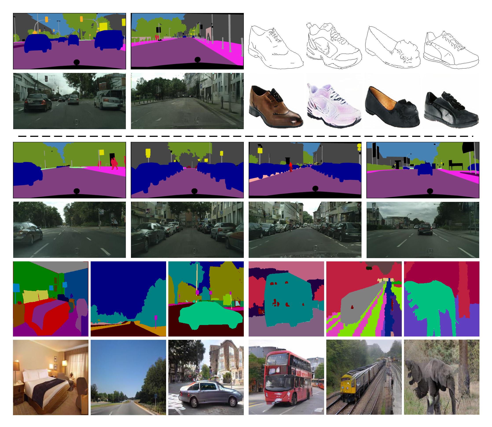

# Lab2Pix

Lab2Pix: Label-Adaptive Generative Adversarial Network for Unsupervised Image Synthesis.
In ACM MM 2020.

Label-Guided Generative Adversarial Network for Realistic Image Synthesis.

## Lab2Pix-V1

Go to https://github.com/RoseRollZhu/Lab2Pix-V1

## Lab2Pix-V2

Go to https://github.com/RoseRollZhu/Lab2Pix-V2